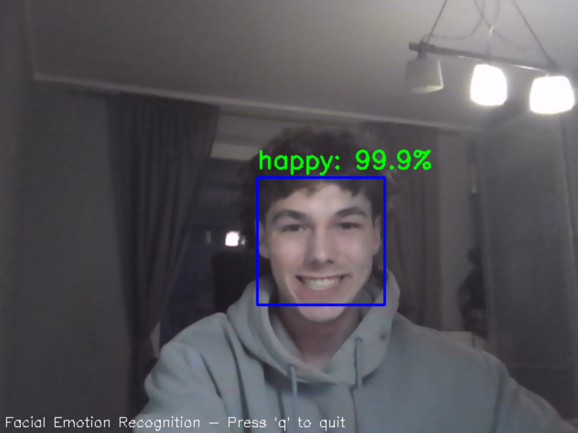
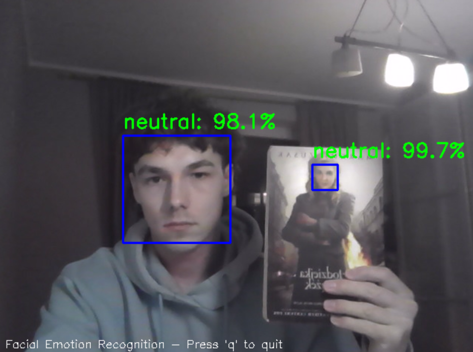

# Facial Emotion Recognition 😊😠😢

<div align="center">


</div>

<p align="center">
  
  
</p>
## 📸 Demo


*Detecting a happy expression with high confidence*


*Recognizing surprised emotion in real-time*


*Detecting emotions for multiple people simultaneously*
## 📋 Overview

A real-time facial emotion recognition system powered by deep learning. This application detects faces and classifies emotions in real-time video streams. Our model is trained on the RAF-DB dataset and achieves 78%+ accuracy, significantly outperforming our previous FER2013-based implementation.

## ✨ Features

- 🎦 Real-time emotion recognition from webcam feed
- 🧠 Advanced ResNet-18 architecture pre-trained on ImageNet
- 🎭 Classification of 7 universal emotions (surprise, fear, disgust, happy, sad, angry, neutral)
- 📊 Live confidence scores for detected emotions
- ⚡ Optimized performance on standard hardware

## 📂 Project Structure

```
├── data/                      # Dataset directory
│   └── DATASET/
│       ├── test/              # Test data split by emotion classes
│       └── train/             # Training data split by emotion classes
├── models/                    # Saved model weights
│   └── ResNet_epoch_50.pth    # Pre-trained model
├── src/
│   ├── dataset.py             # Dataset loading and preprocessing
│   ├── face.py                # Face detection and emotion recognition
│   └── utils.py               # Utility functions
├── notebooks/
│   └── training.ipynb         # Model training notebook
├── main.py                    # Main application script
├── README.md                  # Project documentation
└── LICENSE                    # MIT License
```

## 📊 Dataset Information

This project uses the **RAF-DB** (Real-world Affective Faces Database), containing facial images labeled with 7 basic emotions.

### Dataset Structure

```
data/
└── DATASET/
    ├── test/
    │   ├── 1/  # surprise
    │   ├── 2/  # fear
    │   ├── 3/  # disgust
    │   ├── 4/  # happy
    │   ├── 5/  # sad
    │   ├── 6/  # angry
    │   └── 7/  # neutral
    └── train/
        ├── 1/
        ├── 2/
        ├── 3/
        ├── 4/
        ├── 5/
        ├── 6/
        └── 7/
```

## 🚀 Installation & Setup

1. **Clone the repository:**
   ```bash
   git clone https://github.com/DominikJur/PyTorch-OpenCV-Facial-Expression-Recogniser.git
   cd PyTorch-OpenCV-Facial-Expression-Recogniser
   ```

2. **Create and activate a virtual environment:**
   ```bash
   python -m venv venv
   # On Windows:
   venv\Scripts\activate
   # On Unix or MacOS:
   source venv/bin/activate
   ```

3. **Install dependencies:**
   ```bash
   pip install torch torchvision opencv-python pillow scikit-learn matplotlib tqdm
   ```


## 🎮 Usage

Run the main application for real-time webcam-based emotion recognition:

```bash
python main.py
```

- Press 'q' to exit the application

## 🧠 Model Architecture


- **Base Architecture**: ResNet-18 (pre-trained on ImageNet)
- **Training Methodology**:
  - Fine-tuned on RAF-DB dataset
  - 50+ epochs of training
  - Adam optimizer (lr=0.001)
  - Cross-Entropy Loss function
- **Input Processing**:
  - 48×48 RGB images
  - Data augmentation: horizontal flips, rotations, normalization
- **Output**: 7-class emotion classification with confidence scores

## 📈 Performance Metrics

| Metric | Value |
|--------|-------|
| Accuracy | 78%+ |
| Inference Time | Real-time |
| Model Size | ~44MB |


## 📄 License

This project is licensed under the MIT License - see the [LICENSE](LICENSE) file for details.

## 🙏 Acknowledgments

- RAF-DB dataset providers
- PyTorch and OpenCV communities
- Academic research on facial emotion recognition

---

<div align="center">
  <b>Made with ❤️ by Dominik Jur</b>
</div>
